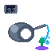

# ioBroker ESP32 Irrigation Adapter

**Tests:** 

## ESP32 Garden Irrigation System Adapter

This adapter connects ioBroker to an ESP32-based garden irrigation system with Modbus soil sensors. It provides comprehensive monitoring and control capabilities for automated garden watering.

### Features

- **Real-time Monitoring**
  - Soil moisture and temperature via Modbus sensors
  - Relay status monitoring
  - System uptime and connection status
  - Next scheduled irrigation time

- **Manual Control**
  - Individual relay control for 2 